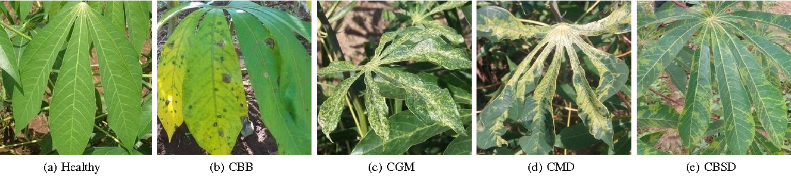

# Plant Disease Identification
  Crop diseases are a major threat to food security, but their rapid identification remains difficult in many parts of the world due to the lack of the necessary infrastructure. The combination of increasing global smartphone penetration and recent advances in computer vision made possible by deep learning has paved the way for smartphone-assisted disease diagnosis. Using a public dataset of 87000 images of diseased and healthy plant leaves collected under controlled conditions, we train a deep convolutional neural network to identify 14 crop species and 26 diseases (or absence thereof). The trained model achieves an accuracy of more than 96% on a held-out test set, demonstrating the feasibility of this approach. Overall, the approach of training deep learning models on increasingly large and publicly available image datasets presents a clear path toward smartphone-assisted crop disease diagnosis on a massive global scale.

Measurement of Performance
To get a sense of how our approaches will perform on new unseen data, and also to keep a track of if any of our approaches are overfitting, we run all our experiments across a whole range of train-test set splits, namely 80–20 (80% of the whole dataset used for training, and 20% for testing). It must be noted that in many cases, thedataset has multiple images of the same leaf (taken from different orientations), and we have the mappings of such cases for 51,112 images out of the 87,306 images; and during all these test-train splits, we make sure all the images of the same leaf goes either in the training set or the testing set. Further, for every experiment, we compute the mean precision, mean recall, mean F1 score, along with the overall accuracy over the whole period of training at regular intervals (at the end of every epoch). We use the final mean F1 score for the comparison of results across all of the different experimental configurations.

Approach

We evaluate the applicability of deep convolutional neural networks for the classification problem described above. We focus on two popular architectures, namely AlexNet (Krizhevsky et al., 2012), and GoogLeNet (Szegedy et al., 2015), which were designed in the context of the “Large Scale Visual Recognition Challenge” (ILSVRC) (Russakovsky et al., 2015) for the ImageNet dataset (Deng et al., 2009).

The AlexNet architecture (see Figure S2) follows the same design pattern as the LeNet-5 (LeCun et al., 1989) architecture from the 1990s. The LeNet-5 architecture variants are usually a set of stacked convolution layers followed by one or more fully connected layers. The convolution layers optionally may have a normalization layer and a pooling layer right after them, and all the layers in the network usually have ReLu non-linear activation units associated with them. AlexNet consists of 5 convolution layers, followed by 3 fully connected layers, and finally ending with a softMax layer. The first two convolution layers (conv{1, 2}) are each followed by a normalization and a pooling layer, and the last convolution layer (conv5) is followed by a single pooling layer. The final fully connected layer (fc8) has 38 outputs in our adapted version of AlexNet (equaling the total number of classes in our dataset), which feeds the softMax layer. The softMax layer finally exponentially normalizes the input that it gets from (fc8), thereby producing a distribution of values across the 38 classes that add up to 1. These values can be interpreted as the confidences of the network that a given input image is represented by the corresponding classes. All of the first 7 layers of AlexNet have a ReLu non-linearity activation unit associated with them, and the first two fully connected layers (fc{6, 7}) have a dropout layer associated with them, with a dropout ratio of 0.5.

The GoogleNet architecture on the other hand is a much deeper and wider architecture with 22 layers, while still having considerably lower number of parameters (5 million parameters) in the network than AlexNet (60 million parameters). An application of the “network in network” architecture (Lin et al., 2013) in the form of the inception modules is a key feature of the GoogleNet architecture. The inception module uses parallel 1 × 1, 3 × 3, and 5 × 5 convolutions along with a max-pooling layer in parallel, hence enabling it to capture a variety of features in parallel. In terms of practicality of the implementation, the amount of associated computation needs to be kept in check, which is why 1 × 1 convolutions before the above mentioned 3 × 3, 5 × 5 convolutions (and also after the max-pooling layer) are added for dimensionality reduction. Finally, a filter concatenation layer simply concatenates the outputs of all these parallel layers. While this forms a single inception module, a total of 9 inception modules is used in the version of the GoogLeNet architecture that we use in our experiments. A more detailed overview of this architecture can be found for reference in (Szegedy et al., 2015).

We analyze the performance of both these architectures on the PlantVillage dataset by training the model from scratch in one case, and then by adapting already trained models (trained on the ImageNet dataset) using transfer learning. In case of transfer learning, we re-initialize the weights of layer fc8 in case of AlexNet, and of the loss {1,2,3}/classifier layers in case of GoogLeNet. Then, when training the model, we do not limit the learning of any of the layers, as is sometimes done for transfer learning. In other words, the key difference between these two learning approaches (transfer vs. training from scratch) is in the initial state of weights of a few layers, which lets the transfer learning approach exploit the large amount of visual knowledge already learned by the pre-trained AlexNet and GoogleNet models extracted from ImageNet (Russakovsky et al., 2015).

To summarize, we have a total of 60 experimental configurations, which vary on the following parameters:

1. Choice of deep learning architecture:

AlexNet,

GoogLeNet.

2. Choice of training mechanism:

Transfer Learning,

Training from Scratch.

3. Choice of dataset type:

Color,

Gray scale,

Leaf Segmented.

4. Choice of training-testing set distribution:

Train: 80%, Test: 20%,

Train: 60%, Test: 40%,

Train: 50%, Test: 50%,

Train: 40%, Test: 60%,

Train: 20%, Test: 80%.

Throughout this project, we have used the notation of Architecture:TrainingMechanism:DatasetType:Train-Test-Set-Distribution to refer to particular experiments. For instance, to refer to the experiment using the GoogLeNet architecture, which was trained using transfer learning on the gray-scaled dataset on a train—test set distribution of 80–20, we will use the notation AlexNet:TransferLearning:GrayScale:80–20.

# Requirements:
  0. Python
  1. Tensorflow
  2. Keras
  3. Django
  
## Output

Model:https://drive.google.com/open?id=1tLMUYkwk2SAsCOijMlE93BLdRAQXkX3H
